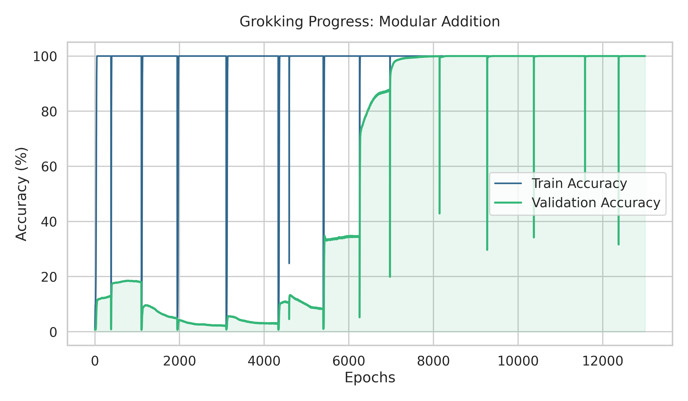

# Grokking: Generalization Beyond Overfitting

A PyTorch implementation exploring the **Grokking** phenomenon in Transformer models through modular arithmetic. This project investigates the transition from memorization to algorithmic generalization as described in the seminal work by Power et al. [1].

## Visualizations

Example grokking process on modulo addition $\pmod{97}$:

## Implementation Details

*   **Task:** Modular addition $a + b \pmod{P}$
*   **Architecture:** Small-scale Transformer (Decoder-only)
*   **Optimizer:** AdamW with high Weight Decay to induce generalization.
*   **Hardware:** Originally developed for **AMD Radeon Series (ROCm)**, currently being benchmarked on **NVIDIA A40**.

## Future Work

*   [ ] Analyze high-dimensional embeddings using dimensionality reduction methods like **t-SNE** or **PCA**.
*   [ ] Investigate the impact of different weight initialization methods.
*   [ ] Analyze training dynamics (memorization, circuit formation, and cleanup phases) based on Nanda et al. [2].
---

### References

[1] Alethea Power et al. **"Grokking: Generalization Beyond Overfitting on Small Algorithmic Datasets."** arXiv:2201.02177 [cs.LG], 2022. [https://arxiv.org/abs/2201.02177](https://arxiv.org/abs/2201.02177)

[2] Neel Nanda et al. **"Progress measures for grokking via mechanistic interpretability."** ICLR, 2023. arXiv:2301.05217 [cs.LG]. https://arxiv.org/abs/2301.05217